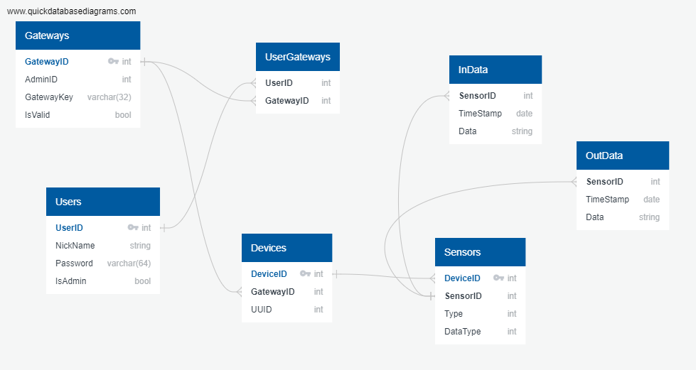

# LSEL2021-E3-Domotic
This repository contains the project of Group 3 for the subject LSEL, part of the Master's Degree in Electronic Systems (MUISE) from the Polytechnic School of Madrid (UPM).

The project consists of three parts: the end node (sensors, actuators), a gateway, and a remote server. 
## End node
The code corresponding to this part can be found in the */end_node* folder and is writen in C.

The *include* and *src* folders contain all the code (.h and .c) of the four finite state machines that run on the ESP32 (leds, sensor, events and control), as well as other auxiliary files, such as the code for the BME280 sensor, the functions for wifi connection or the MQTT protocol handlers.

The */test* folder contains the *test_fsm_functions.c* file and its corresponding header, where Unity is used to test the correct functioning of all the FSMs.

A PCB has been designed using Altium Designer to integrate all the components of the end node on a single board: the BME280 which is a temperature and humidity sensor, some LED strip lights and the ESP32-WROOM-32, which is the microcontroller that stablishes the connection with the gateway. The complete design can be found under the */pcb_altium* folder.

## Gateway

The gateway is in charge of stablishing a bidirectional communication between the devices and the server, where all the data is stored and all the decisions are made. 

The code has been written in Python, and the MQTT protocol is used to communicate, in particular the Eclipse Paho implementation.

To run this part of the code, two different scripts must be executed, which corresponds to two FSMs that should run in parallel on two different terminals.

1. The first script is *ask_server_data.py*. After running this program, the user is promted with the message "Insert key: ". The expected key is 1. After pressing Enter, the first FSM will be initialized, and its function is to constantly ask the server for data via an HTTP communication.

2. The second script, that should run on a different terminal, is *control_flow.py*. Similarly, the user is prompted to insert a key and the expected value is once again 1. Then, the control flow FSM starts running, and is in charge of receiving all the data from the end node via MQTT, and sending it to the server via HTTP.

Both FSMs are implemented using *pytransitions*.

## Server
The code for the server is completely written in Python and HTML. It is composed by an SQL request handler script and a *main.py* file that instantiates the SQL handler and creates the website for data visualization and control of the actuators. The website can be accessed following this link:

> http://40.114.216.24/

The */data* folder contains the HTML files used to build the website, and the /db_files folder holds the SQL database, that follows this structure:

An *install.sh* file is provided to automatically install all the library dependencies of this part of the project.